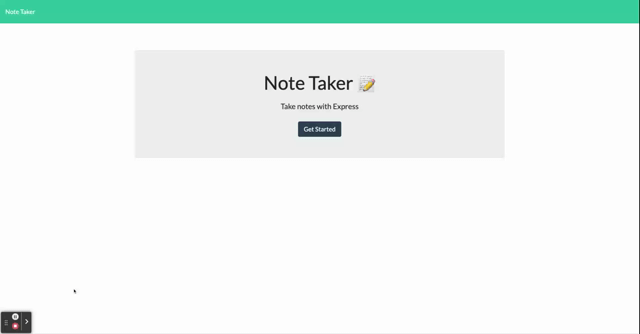

# Express.js Note Taker

## Table of Contents
* [Description](#description)
* [Lessons Learned](#lessons-learned)
* [Usage](#usage)
* [Tools](#tools)
* [How to Contribute](#how-to-contribute)
* [License](#license)
* [Questions](#questions)
## Description 
This application takes inputs from the user in the browser, and stores them as notes. The user can recall prior notes, create new notes, or delete existing notes as needed. This can be usefull to keep track of tasks, or other information needed throughout the day since it is mobile friendly. The reason for building was to create a simple and clean way to manage notes.

## Lessons Learned
This application utilized express and inquirer. While I have used inquirer previously, developing this application required more advanced use of the tool, which helped my knowledge base grow. I also learned a lot about setting up a server and connecting it to the front-end.
## Usage
To use this application, please visit the deployed page here: https://peaceful-basin-67305.herokuapp.com/
 
  ### Demo
  
## Tools
                

## How to Contribute
If you would like to contribute, please follow the relevant steps outlined here: https://www.dataschool.io/how-to-contribute-on-github/ or send feedback to Sandy Marr. 
## License

Copyright 2021 Sandra Marr

  Permission is hereby granted, free of charge, to any person obtaining a copy of this software and associated documentation files (the "Software"), to deal in the Software without restriction, including without limitation the rights to use, copy, modify, merge, publish, distribute, sublicense, and/or sell copies of the Software, and to permit persons to whom the Software is furnished to do so, subject to the following conditions:
  
  The above copyright notice and this permission notice shall be included in all copies or substantial portions of the Software.
  
  THE SOFTWARE IS PROVIDED "AS IS", WITHOUT WARRANTY OF ANY KIND, EXPRESS OR IMPLIED, INCLUDING BUT NOT LIMITED TO THE WARRANTIES OF MERCHANTABILITY, FITNESS FOR A PARTICULAR PURPOSE AND NONINFRINGEMENT. IN NO EVENT SHALL THE AUTHORS OR COPYRIGHT HOLDERS BE LIABLE FOR ANY CLAIM, DAMAGES OR OTHER LIABILITY, WHETHER IN AN ACTION OF CONTRACT, TORT OR OTHERWISE, ARISING FROM, OUT OF OR IN CONNECTION WITH THE SOFTWARE OR THE USE OR OTHER DEALINGS IN THE SOFTWARE.

## Questions

For any questions, please contact Sandra Marr: [GitHub](https://github.com/sandra-marr) or [Email](srpeters44@gmail.com)